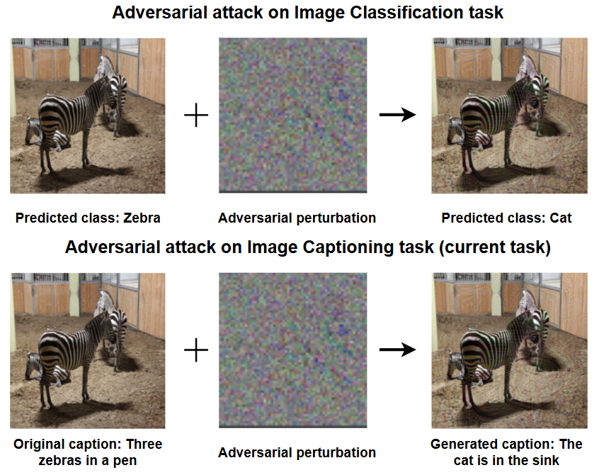
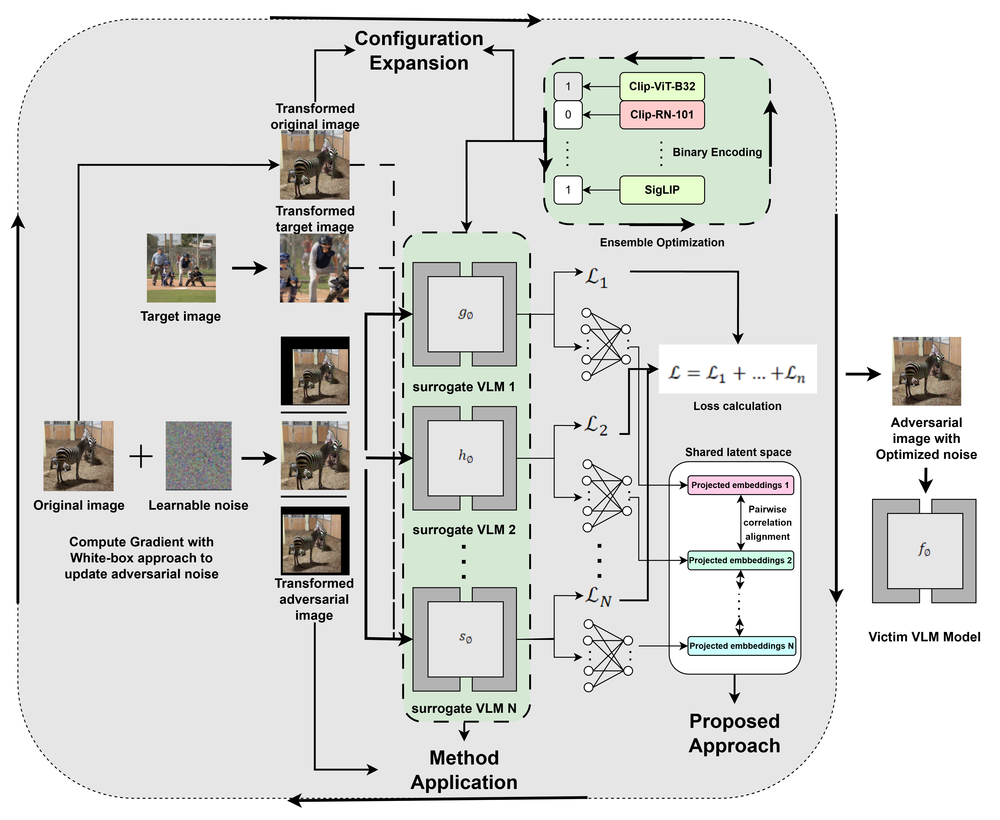
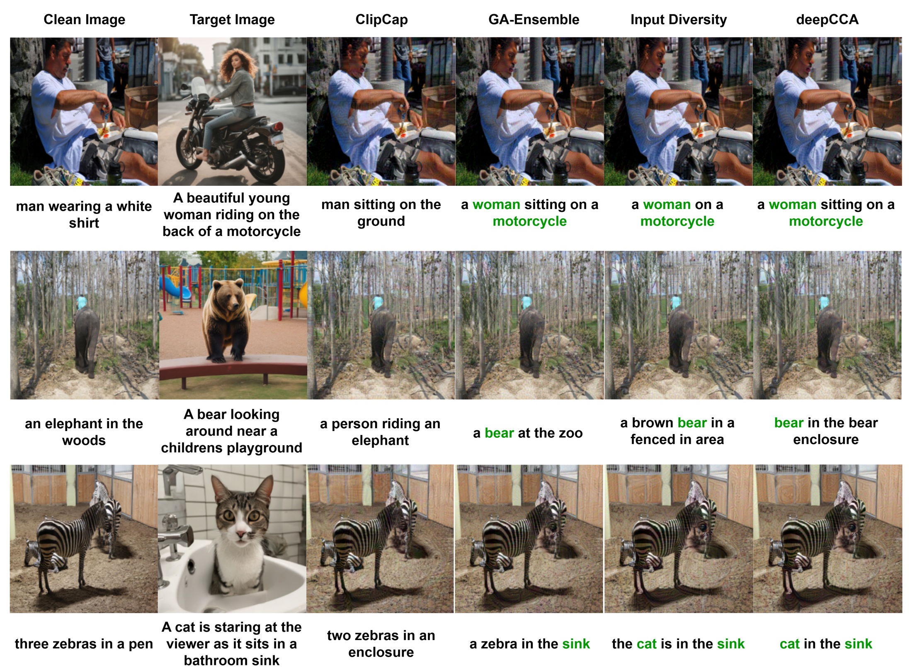
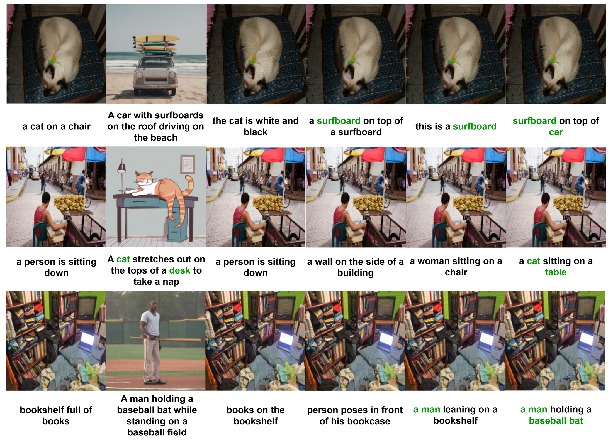

# Targeted Adversarial Attack on Vision-Language Models

**Thesis project — VNU-HCM University of Information Technology.**

---

## Overview

This work uses a targeted attack framework as a tool to **evaluate the robustness** of vision-language models (VLMs) in image captioning: a more effective attack exposes model weaknesses more thoroughly, so attack strength serves as a robustness probe.

The repository implements a targeted adversarial attack that extends the **Chain-of-Attack** framework by integrating:
* **GA-optimized surrogate ensembles**
* **Input diversity**
* **Deep CCA-based common space embedding**.

<p align="center">
  <br>
  <em>Comparison between adversarial attacks on the image classification task and the image captioning task.</em>
</p>

The full pipeline below illustrates how these techniques are combined into a single attack framework.

<p align="center">
  <br>
  <em>Full pipeline illustrating all the techniques integrated within the scope of this work.</em>
</p>

---

## Repository Structure

```text
BLIP2/
    blip2_ensemble.ipynb               # Simple surrogate ensemble
    blip2_DI.ipynb                     # Ensemble + input diversity (adv images)
    blip2_DI_full.ipynb                # Ensemble + input diversity (ori, tgt, adv)
    blip2_DI_feature_alignment.ipynb   # Full pipeline: ensemble + DI + Deep CCA
Git-base/    # Same structure as BLIP2/
Img2Prompt/  # Same structure as BLIP2/
Kosmos2/     # Same structure as BLIP2/
OFA-base/    # Same structure as BLIP2/
Tag2Text/    # Same structure as BLIP2/
UniDiffuser/ # Same structure as BLIP2/
deepCCA/
    deepmcca_256_with_scalers_and_encoders.pkl  # Pretrained Deep CCA weights
image_generation.ipynb  # Inference: generate target images
train_MLP.ipynb         # Train MLP with Deep CCA
genetic_algorithm.ipynb # Define helper functions for GA-based surrogate subset optimization
```

## Datasets

- **Test images (1k subset)**: [Kaggle Dataset](https://www.kaggle.com/datasets/sealeopard/1k-images)
- **MS-COCO**: [Kaggle Dataset](https://www.kaggle.com/datasets/nikhil7280/coco-image-caption)

---

## Results

Targeted-attack effectiveness measured by **CLIP Score (↑)** at ε = 16/255, across six
black-box victim VLMs and four CLIP evaluation backbones (the **Ensemble** column is the mean over
the four). Rows per VLM: **Clean Image** (no attack) and **ClipCap** (baseline) are
references; **Ens**, **Ens + DI**, and **Ens + DI + deepCCA** are this work's configurations.
Bold marks the best configuration per column.

| VLM | Method | RN101 | ViT-B/16 | ViT-B/32 | ViT-L/14 | Ensemble |
|---|---|---|---|---|---|---|
| **Img2Prompt** | Clean Image | 0.4564 | 0.4693 | 0.4956 | 0.3443 | 0.4414 |
| | ClipCap (baseline) | 0.4669 | 0.4787 | 0.5048 | 0.3515 | 0.4505 |
| | Ens | 0.5638 | 0.5825 | 0.6004 | 0.4697 | 0.5541 |
| | Ens + DI | 0.6848 | 0.7047 | 0.7193 | 0.6162 | 0.6813 |
| | Ens + DI + deepCCA | **0.6993** | **0.7194** | **0.7328** | **0.6334** | **0.6962** |
| **BLIP-2** | Clean Image | 0.4814 | 0.5080 | 0.5317 | 0.3842 | 0.4763 |
| | ClipCap (baseline) | 0.4868 | 0.5107 | 0.5339 | 0.3857 | 0.4793 |
| | Ens | 0.5733 | 0.6002 | 0.6196 | 0.4866 | 0.5699 |
| | Ens + DI | 0.6631 | 0.6885 | 0.7028 | 0.5926 | 0.6618 |
| | Ens + DI + deepCCA | **0.6687** | **0.6933** | **0.7090** | **0.6004** | **0.6679** |
| **GIT-base** | Clean Image | 0.5115 | 0.5376 | 0.5630 | 0.4084 | 0.5051 |
| | ClipCap (baseline) | 0.5029 | 0.5249 | 0.5508 | 0.4045 | 0.4958 |
| | Ens | 0.5822 | 0.6118 | 0.6317 | 0.4989 | 0.5812 |
| | Ens + DI | 0.6628 | 0.6910 | 0.7075 | 0.5912 | 0.6631 |
| | Ens + DI + deepCCA | **0.6758** | **0.7024** | **0.7178** | **0.6062** | **0.6756** |
| **OFA-base** | Clean Image | 0.4814 | 0.5141 | 0.5398 | 0.3879 | 0.4808 |
| | ClipCap (baseline) | 0.4932 | 0.5264 | 0.5493 | 0.4009 | 0.4925 |
| | Ens | 0.5438 | 0.5812 | 0.6015 | 0.4552 | 0.5454 |
| | Ens + DI | 0.6466 | 0.6787 | 0.6958 | 0.5729 | 0.6485 |
| | Ens + DI + deepCCA | **0.6569** | **0.6904** | **0.7057** | **0.5839** | **0.6592** |
| **Tag2Text** | Clean Image | 0.4766 | 0.4982 | 0.5266 | 0.3674 | 0.4672 |
| | ClipCap (baseline) | 0.4835 | 0.5074 | 0.5328 | 0.3738 | 0.4744 |
| | Ens | 0.5542 | 0.5801 | 0.5996 | 0.4594 | 0.5483 |
| | Ens + DI | 0.6548 | 0.6784 | **0.6941** | 0.5786 | 0.6515 |
| | Ens + DI + deepCCA | **0.6561** | **0.6802** | 0.6932 | **0.5807** | **0.6525** |
| **Kosmos2** | Clean Image | 0.4450 | 0.4694 | 0.4957 | 0.3438 | 0.4385 |
| | ClipCap (baseline) | 0.4544 | 0.4664 | 0.4933 | 0.3390 | 0.4383 |
| | Ens | 0.5733 | 0.5824 | 0.6055 | 0.4727 | 0.5585 |
| | Ens + DI | 0.6745 | 0.6885 | 0.7087 | 0.5974 | 0.6673 |
| | Ens + DI + deepCCA | **0.6797** | **0.6953** | **0.7155** | **0.6063** | **0.6742** |

Averaged over the six VLMs, the full method (**Ens + DI + deepCCA**) improves target-caption
CLIP Score by **~19.9 points** over the ClipCap baseline at ε = 16/255 (**~11.1** at ε = 8/255).
Within the ablation, **input diversity (DI)** contributes the largest single gain
(~0.10–0.13 CLIP Score over the base ensemble), while **Deep CCA** common-space embedding adds a
smaller but consistent further improvement across nearly all models and backbones.

## Qualitative Results

<p align="center">
  <br>
  <br>
  <em>Illustration of several attack cases on the GIT-base model under an attack budget of ε = 8/255.</em>
</p>

---

## Pretrained Weights

Download the following weights and upload to Kaggle as a dataset before running notebooks.

- **ClipCap** (surrogate): [Google Drive](https://drive.google.com/file/d/1IdaBtMSvtyzF0ByVaBHtvM0JYSXRExRX)
- **BLIP base** (surrogate): [Salesforce](https://storage.googleapis.com/sfr-vision-language-research/BLIP/models/model_base.pth)
- **BLIP large** (surrogate): [Salesforce](https://storage.googleapis.com/sfr-vision-language-research/BLIP/models/model_base_capfilt_large.pth)
- **BEiT-3** (surrogate): [GitHub Release](https://github.com/addf400/files/releases/download/beit3/beit3_large_patch16_384_coco_retrieval.pth)
- **Tag2Text** (target): [Hugging Face](https://huggingface.co/spaces/xinyu1205/recognize-anything/blob/main/tag2text_swin_14m.pth)

---

## Running the Notebooks

All notebooks are designed to run on **Kaggle** (free GPU).

1. Upload datasets and pretrained weights to Kaggle as datasets.
2. Open the desired notebook on Kaggle.
3. Update dataset paths if necessary.
4. Run all cells.

---

## Acknowledgements

This project implements and extends the attack pipeline described in:
- [Chain-of-Attack (CVPR 2025)](https://openaccess.thecvf.com/content/CVPR2025/papers/Xie_Chain_of_Attack_On_the_Robustness_of_Vision-Language_Models_Against_CVPR_2025_paper.pdf) — original paper

**Code and weights used from:**
- [ClipCap](https://github.com/rmokady/CLIP_prefix_caption)
- [AICAttack](https://github.com/UTSJiyaoLi/AICAttack) — dataloader
- [Tag2Text](https://github.com/mattmazzola/Tag2Text)
- [BEiT-3](https://github.com/fonzi22/unilm)
- [OFA](https://github.com/OFA-Sys/OFA)
- [LAVIS](https://github.com/salesforce/LAVIS)

**Pretrained weights:**
- [BLIP](https://github.com/salesforce/BLIP)
- [BEiT-3 weights](https://github.com/addf400/files/releases)
